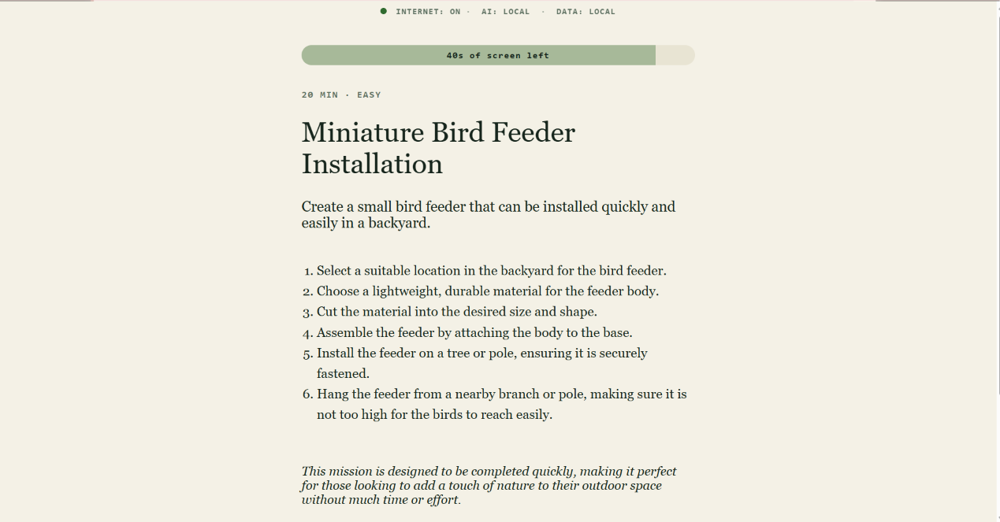
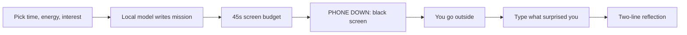
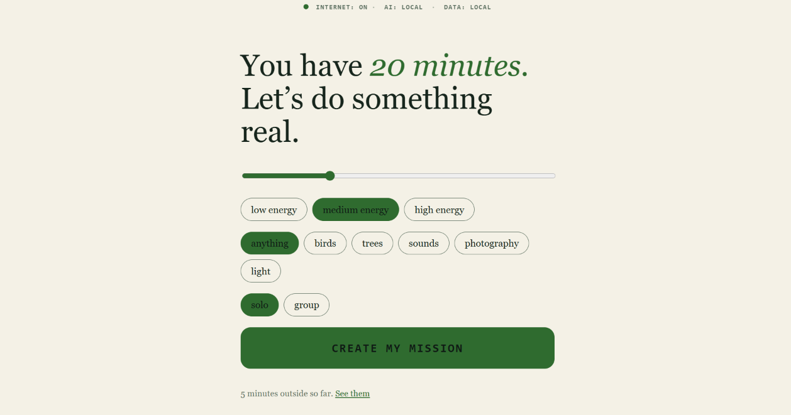
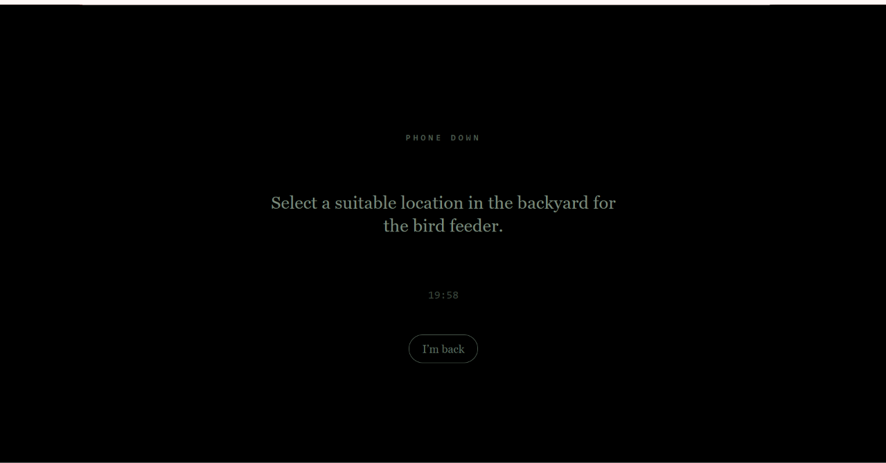
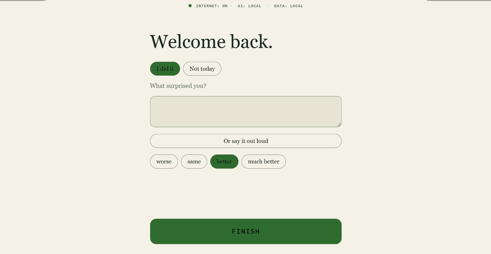
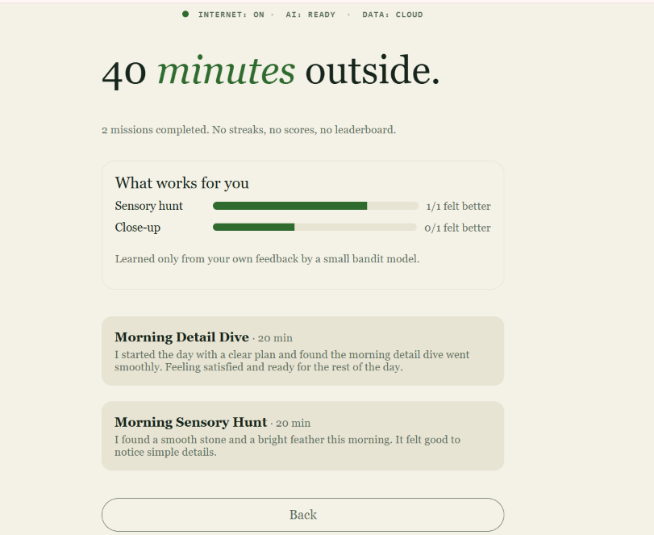

<div align="center">

# 🌿 Doorstep

### The AI app that is over the moment you cross your own doorstep.

One tiny outdoor mission, written by a **local open-weight model**.<br>
45 seconds of screen. Then the app goes black and you go outside.




</div>

---

## The Problem

Apps are built to keep you looking at them. Even the ones that say they want you outside keep you scrolling inside.

## The Idea

**A hard screen budget.** Every mission gives you 45 seconds of screen to read it. When the bar hits zero, Doorstep launches outdoor mode by itself: a black screen, one instruction, a timer. There is no feed, no chat, no streak. The app succeeds when you stop using it.



## Screenshots

<table>
  <tr>
    <td align="center"><br><b>Home</b><br>"You have 20 minutes."</td>
    <td align="center"><br><b>Mission card</b><br>The 45s bar drains.</td>
    <td align="center"><br><b>Phone down</b><br>The app disappears.</td>
  </tr>
  <tr>
    <td align="center"><br><b>Reflection</b><br>Written locally.</td>
    <td align="center"><br><b>History</b><br>Minutes outside. No scores.</td>
    <td align="center"><br><b>Offline</b><br>Wi-Fi off, AI still local.</td>
  </tr>
</table>

**Live demo:** https://doorstep-alpha.vercel.app (hosted mode, see below) · **Full local mode:** run it yourself in 5 minutes.

## Two Modes

| | **Local mode** (the real thing) | **Hosted demo** (for trying it fast) |
|---|---|---|
| Model | Qwen2.5-1.5B via Ollama on your CPU | openai/gpt-oss-20b via Groq's API |
| Your data | Never leaves your machine | Your choices and typed note go to our Render server and to Groq |
| Offline | Yes | No |
| Cost per mission | Zero | Uses a hosted API |
| Status strip | `AI: LOCAL · DATA: LOCAL` | `AI: READY · DATA: CLOUD` |

The hosted demo exists so you can try the flow without installing anything. The privacy and offline claims below apply to **local mode only**. Hosted history is stored per browser on a free-tier server and can reset when the server restarts.

## The ML Inside

Not a task list with a chatbot on top:

- **It learns you.** A Thompson-sampling bandit picks the mission style that leaves you feeling best, and the card says why.
- **It avoids repeats by meaning**, not by title, using embeddings and cosine similarity.
- **It remembers privately.** Your notes are embedded locally, and reflections connect to related earlier notes.

Details, simulation results, and honest limits: [`docs/ML.md`](docs/ML.md).

## Why Open AI?

Why not just call a closed API? Because of what this app handles: where you walk, what you notice, how you feel.

| Advantage | What it means here |
|---|---|
| **Your notes stay on your machine** | What surprised you outdoors goes into a local SQLite file. No account, no cloud. |
| **Works with Wi-Fi off** | The status strip flips to `INTERNET: DISCONNECTED · AI: LOCAL` and missions still generate. |
| **Zero cost per mission** | Missions and reflections cost nothing to generate. |
| **Swappable model** | Set `DOORSTEP_MODEL`, restart, done. We benchmarked two models and picked with data. |
| **Inspectable prompts** | Every prompt lives in `backend/app/ai.py`. Read it, change it. |

## How It Works

1. **Ask:** you choose minutes, energy, interest, solo or group.
2. **Generate:** the model returns JSON constrained by a schema, validated with Pydantic, retried twice, and screened for unsafe content.
3. **Fallback:** if the model is missing, slow, or wrong, a hand-written mission is served and marked *OFFLINE-SAFE MISSION*. The app never crashes.
4. **Leave:** the budget runs out, the screen goes black.
5. **Reflect:** you type what surprised you, and get two honest sentences back.

Prompts carry only the current constraints and the last three mission titles, never your full history.

## Local / Offline Mode

| Works with no internet | Needs the network |
|---|---|
| Mission generation | Nothing in this version |
| Reflections | |
| History and saved data | |
| The whole UI | |

There are no maps, weather, or sync, so there is nothing to pretend about.

## Privacy

- **Collected:** your time, energy, and interest choices; the generated mission; your typed note; a feeling rating; the reflection.
- **Stored:** `backend/doorstep.db` (SQLite), on your machine.
- **Leaves the machine:** nothing. The only calls are browser → `localhost` backend → `localhost` Ollama.
- **Optional voice:** only if you install `backend/requirements-voice.txt`; it also runs locally.

## Architecture

```
 Browser (React + Vite, localhost:5173)
   │  /api
   ▼
 FastAPI (localhost:8000)  ── CORS: localhost only
   ├─ schema.py     input validation, prompt-safe sanitizing
   ├─ ai.py         prompt → Ollama → JSON validate → safety screen → retry
   │                         │ on failure ▼
   ├─ fallback.py   hand-written missions and reflections
   └─ store.py      SQLite, local only
   ▼
 Ollama (localhost:11434) → open-weight model on CPU, kept warm 30 min
```

More in [`docs/ARCHITECTURE.md`](docs/ARCHITECTURE.md).

## Tech Stack

FastAPI · Pydantic · SQLite · httpx · Ollama · React 18 · Vite · pytest · vitest

## Installation

```bash
git clone https://github.com/Rehan1604/doorstep.git
cd doorstep
ollama pull qwen2.5:1.5b-instruct
cd backend && pip install -r requirements.txt
cd ../frontend && npm install
```

## Running Locally

```bash
# terminal 1
cd backend && uvicorn app.main:app --port 8000

# terminal 2
cd frontend && npm run dev        # open http://localhost:5173
```

Tests:

```bash
cd backend && python -m pytest -q     # 13 tests
cd frontend && npm test               # 5 tests
```

## Model Setup

Default: `qwen2.5:1.5b-instruct`. Change it with `DOORSTEP_MODEL` (see `.env.example`).
Benchmark on your own hardware:

```bash
python ai/benchmark.py qwen2.5:1.5b-instruct phi3.5 --runs 10
```

## Technical Decisions

Measured on a Core i5-13420H laptop, 16 GB RAM, **CPU only**, 10 runs each:

| Model | Valid JSON | Safe output | Median | p90 |
|---|---|---|---|---|
| **qwen2.5:1.5b-instruct** | 100% | 100% | **11.4 s** | 13.7 s |
| phi3.5 | 100% | 100% | 29.4 s | 41.4 s |

Both were reliable, so latency decided it. The 11-second wait is shown as a breathing screen instead of a spinner, so the delay reads as intent.

## Challenges

- **CPU-only inference is slow.** We designed the wait instead of hiding it.
- **A model outage must never break the UI.** Every AI call has a validated fallback.
- **Outdoor advice carries risk.** Prompts forbid risky suggestions, and a second screen on the output rejects climbing, private property, wildlife contact, and similar. AI suggestions can be wrong, so every mission card says to use your own judgement.

## Future Work

Weather-aware missions (optional, online), a phone lock mode, group missions, more models.

## Contributing

Issues and pull requests are welcome.

## License

- **Code:** MIT, see [`LICENSE`](LICENSE).
- **Model:** Qwen2.5-1.5B-Instruct, open-weight.
- Other models you pull carry their own licenses; check each model card.

<div align="center">

*The best AI interaction is the one that ends with you leaving the room.*

</div>