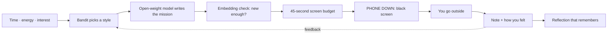

<div align="center">


# 🌿 Doorstep

### The AI app that is over the moment you cross your own doorstep.

Doorstep writes you **one small outdoor mission** with an open-weight model, gives you **45 seconds of screen** to read it, then goes black and sends you outside.<br>
It learns what works for you. In local mode, nothing leaves your machine.


 [🌐 Live demo](https://doorstep-alpha.vercel.app) · [📝 DEV post](YOUR_DEV_POST_URL) · [🧠 The ML](docs/ML.md) · [🔒 Privacy](docs/PRIVACY.md) · [🏗 Architecture](docs/ARCHITECTURE.md)

</div>

---

## The problem

Apps are built to keep you looking at them. Even the ones that say they want you outside keep you scrolling inside.

## The idea

**A hard screen budget.** Every mission gives you 45 seconds to read it. When the bar hits zero, Doorstep goes black: one instruction, one timer, **PHONE DOWN**. You go outside. When you come back you type what surprised you, say how you felt, and get two honest sentences back.

No feed. No chat. No streaks. No leaderboard. **The app succeeds when you stop using it.**



## Screenshots

<table>
  <tr>
    <td align="center"><br><b>Home</b><br>"You have 20 minutes."</td>
    <td align="center"><br><b>Mission</b><br>The 45s bar drains.</td>
    <td align="center"><br><b>Phone down</b><br>The app disappears.</td>
  </tr>
  <tr>
    <td align="center"><br><b>Reflection</b><br>Written locally.</td>
    <td align="center"><br><b>What works for you</b><br>Learned from your feedback.</td>
    <td align="center"><br><b>Offline</b><br>Wi-Fi off, AI still local.</td>
  </tr>
</table>

## It is not a task list with a chatbot on top

| | What it does | Why a dictionary can't |
|---|---|---|
| 🎯 **Style bandit** | Thompson sampling learns which kind of mission (stillness, sensory hunt, close-up, detour…) leaves *you* feeling better, and says why on the card | A dictionary has no memory of you |
| 🧭 **Embedding novelty guard** | Compares each new mission to your recent ones by meaning, and regenerates near-repeats | Title matching misses paraphrases |
| 🧠 **Private semantic memory** | Your notes are embedded; reflections link to related earlier notes | Needs similarity search over your own words |
| 🛡 **Safety layers** | Prompt rules, a keyword screen on output, input sanitizing, sanitized stored text | One layer is not enough |
| 🔁 **Never breaks** | Schema-validated JSON, retries, then hand-written fallback missions | A model outage must not end the app |

Full detail, simulation results, and honest limits: [`docs/ML.md`](docs/ML.md).

## Two modes

| | **Local mode** (the real thing) | **Hosted demo** (to try it fast) |
|---|---|---|
| Mission model | Qwen2.5-1.5B-Instruct via Ollama, on your CPU | openai/gpt-oss-20b via Groq's API |
| Embeddings | `all-minilm` via Ollama | Hashed vectors (lexical, no model) |
| Your data | Never leaves your machine | Choices and notes go to our Render server and to Groq |
| Works offline | **Yes** | No |
| Cost per mission | Zero | Uses a hosted API |
| Status strip | `AI: LOCAL · DATA: LOCAL` | `AI: READY · DATA: CLOUD` |

The privacy and offline claims in this README apply to **local mode only**. See [`docs/PRIVACY.md`](docs/PRIVACY.md).

## Quick start (local mode)

```bash
git clone https://github.com/Rehan1604/doorstep.git
cd doorstep

# models (Ollama must be installed and running)
ollama pull qwen2.5:1.5b-instruct
ollama pull all-minilm

# terminal 1: backend
cd backend
pip install -r requirements.txt
python -m uvicorn app.main:app --port 8000

# terminal 2: frontend
cd frontend
npm install
npm run dev          # open http://localhost:5173
```

**See the offline claim yourself:** turn Wi-Fi off, create a mission. The top strip flips to `INTERNET: DISCONNECTED · AI: LOCAL` and missions still appear.

Optional voice notes (local speech-to-text): `pip install -r backend/requirements-voice.txt`.

**Tests**

```bash
cd backend && python -m pytest -q     # 29 passed
cd frontend && npm test               # 7 passed
python ai/simulate_bandit.py          # reproduce the bandit simulation
python ai/benchmark.py qwen2.5:1.5b-instruct phi3.5 --runs 10   # benchmark models on your machine
```

## Technical decisions

**Model choice, measured.** Core i5-13420H laptop, 16 GB RAM, CPU only, 10 runs each:

| Model | Valid JSON | Safe output | Median | p90 |
|---|---|---|---|---|
| **qwen2.5:1.5b-instruct** ✅ | 100% | 100% | **11.4 s** | 13.7 s |
| phi3.5 | 100% | 100% | 29.4 s | 41.4 s |

Both were reliable, so latency decided it. The 11-second wait is shown as a breathing screen instead of a spinner.

**Bandit simulation** (500 synthetic people, 20 missions each, last 10 missions):

| Simulated people | Random picks their favourite style | Bandit picks it |
|---|---|---|
| Stable taste | 20% | **43%** (avg reward 0.43 → 0.51) |
| Different taste per context | 20% | 25% (barely better) |

This is a simulation, not a user study.

<details>
<summary><b>Configuration (environment variables)</b></summary>

| Variable | Default | Meaning |
|---|---|---|
| `AI_PROVIDER` | `ollama` | `ollama` (local) or `openai` (any OpenAI-compatible API) |
| `DOORSTEP_MODEL` | `qwen2.5:1.5b-instruct` | Model name |
| `OLLAMA_URL` | `http://127.0.0.1:11434` | Ollama address |
| `OPENAI_BASE_URL` | `https://api.openai.com/v1` | Hosted API base (e.g. Groq) |
| `OPENAI_API_KEY` | empty | Set in your host's dashboard, never in git |
| `MODEL_TIMEOUT_S` | `45` | Model timeout |
| `DOORSTEP_DB` | `doorstep.db` | SQLite file |
| `EMBED_PROVIDER` | `auto` | `auto`, `ollama`, or `hash` |
| `EMBED_MODEL` | `all-minilm` | Embedding model |
| `FRONTEND_URL` | `http://localhost:5173` | Extra allowed CORS origin |
| `VITE_API_URL` | empty | Backend URL for the frontend build |

</details>

<details>
<summary><b>Project structure</b></summary>

```
doorstep/
├── backend/
│   ├── app/
│   │   ├── main.py        API routes, CORS
│   │   ├── engine.py      orchestration: bandit → model → novelty → store
│   │   ├── ai.py          Ollama / OpenAI-compatible calls, safety screen
│   │   ├── fallback.py    hand-written missions when the model fails
│   │   ├── store.py       SQLite storage and migrations
│   │   ├── schema.py      validated request and response models
│   │   ├── voice.py       optional local speech-to-text
│   │   └── ml/
│   │       ├── bandit.py  Thompson-sampling style bandit
│   │       └── embed.py   embeddings and similarity
│   └── tests/             29 tests
├── frontend/              React + Vite UI, 7 tests
├── ai/                    benchmark.py, simulate_bandit.py
├── docs/                  ARCHITECTURE, ML, PRIVACY, DEMO
└── screenshots/
```

</details>

## Honest limits

- A 1.5B model writes valid but often generic missions.
- The style bandit needs several missions before it visibly adapts, and it barely helps people whose taste changes by context.
- The safety screen is keyword-based and cannot guarantee safety. Mission cards say to use your own judgement.
- Hosted mode sends your input to third parties, uses lexical matching only, runs on a free tier that sleeps (first request can take about a minute), and can reset its data on redeploy.
- No user study yet. Everything was self-tested.
- There is no account or "delete my data" button yet.

## Roadmap

Opt-in weather, a phone-lock mode, group sessions, a delete-my-data button, a real user test with friends.

## Contributing

Issues and pull requests are welcome. See [`CONTRIBUTING.md`](CONTRIBUTING.md).

## License and credits

- **Code:** MIT, see [`LICENSE`](LICENSE).
- **Qwen2.5-1.5B-Instruct** (local mission model): open-weight, Apache-2.0.
- **all-MiniLM** via Ollama's `all-minilm` (embeddings): Apache-2.0.
- **openai/gpt-oss-20b** (hosted demo only): open-weight, Apache-2.0.
- Built with FastAPI, Pydantic, SQLite, httpx, Ollama, React and Vite.

<div align="center">

*The best AI interaction is the one that ends with you leaving the room.* 🌿

</div>